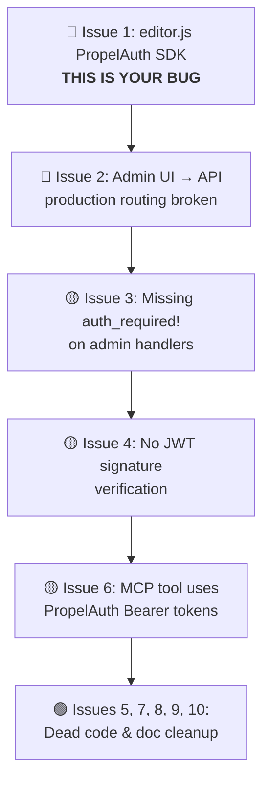

# Zygo CMS Authentication Audit Report

## Root Cause of the Dashboard CORS Error

When you access the admin dashboard, **the browser is making requests to `https://97543635.propelauthtest.com/api/v1/refresh_token`** because [`public/editor.js`](file:///Users/ryan/Code/zygodactyl/static-site/public/editor.js#L4) still imports and initializes the PropelAuth JavaScript SDK:

```javascript
// public/editor.js:4
import { createClient } from 'https://esm.sh/@propelauth/javascript';
```

The PropelAuth SDK's `enableBackgroundTokenRefresh: true` option ([line 48](file:///Users/ryan/Code/zygodactyl/static-site/public/editor.js#L48)) causes it to periodically call your old PropelAuth test tenant to refresh tokens. Since that tenant's CORS policy doesn't include your current domain, you get CORS errors that block the dashboard.

> [!IMPORTANT]
> **This is the direct cause of your dashboard being broken.** The old `editor.js` file is still being served and loaded, and its PropelAuth initialization runs before the page can function.

---

## Complete Findings

### Issue 1: `public/editor.js` — PropelAuth SDK Import & Initialization
**Priority: 🔴 CRITICAL — This is the bug you're hitting**

| Detail | Value |
|--------|-------|
| File | [`public/editor.js`](file:///Users/ryan/Code/zygodactyl/static-site/public/editor.js#L4-L81) |
| Lines | 4, 40–81 |
| Status | Active code, executed in browser |

The file:
- **Line 4**: Imports `createClient` from `https://esm.sh/@propelauth/javascript`
- **Lines 45–56**: Creates a PropelAuth client with `enableBackgroundTokenRefresh: true`, calls `getAuthenticationInfoOrNull()`, and redirects to PropelAuth login if not authenticated
- **Lines 64–73**: Renders a PropelAuth-based user badge with email and logout button
- **Lines 77–81**: `getAuthToken()` helper that retrieves PropelAuth access tokens for API calls

**Fix**: ✅ **Delete `public/editor.js` entirely.** This is a legacy artifact from the old Askama-template-based admin UI. The React SPA in `packages/admin-ui` has fully replaced it. Also clean up associated files:
  - Delete `public/editor.js`
  - Remove the PropelAuth `createClient` mock from `tests/mocks/esm.js`
  - Remove any tests that exercise `editor.js` PropelAuth logic

---

### Issue 2: Admin UI → API Routing Is Broken in Production
**Priority: 🔴 CRITICAL**

| Detail | Value |
|--------|-------|
| File | [`packages/admin-ui/wrangler.toml`](file:///Users/ryan/Code/zygodactyl/static-site/packages/admin-ui/wrangler.toml) |
| Config | `not_found_handling = "single-page-application"` |

The React admin UI makes all API calls as **relative URLs** (e.g., `fetch('/api/entries')`). This works in local dev because Vite proxies `/api` to `http://127.0.0.1:8787`.

In production:
- Admin UI lives at `admin.zygodactylstudios.com`
- API worker lives at `api.zygodactylstudios.com`
- A request to `admin.zygodactylstudios.com/api/entries` hits the admin-ui-worker, which has SPA fallback enabled → it returns `index.html` (HTTP 200, `text/html`) instead of reaching the API worker

**Fix**: ✅ **Use absolute URLs with cross-origin cookie forwarding.** Change all `fetch('/api/...')` calls in `packages/admin-ui/src/` to use `https://api.<domain>/api/...` with `{ credentials: 'include' }` so the browser sends the `CF_Authorization` cookie cross-origin. The API base URL should come from an environment variable (e.g., `VITE_API_BASE_URL`) so it works in both local dev and production. The setup script already provisions CORS on the API Access app with `allow_credentials: true`.

  Affected files:
  - [`Dashboard.tsx`](file:///Users/ryan/Code/zygodactyl/static-site/packages/admin-ui/src/pages/Dashboard.tsx)
  - [`Editor.tsx`](file:///Users/ryan/Code/zygodactyl/static-site/packages/admin-ui/src/pages/Editor.tsx)
  - [`Posts.tsx`](file:///Users/ryan/Code/zygodactyl/static-site/packages/admin-ui/src/pages/Posts.tsx)
  - [`PagesList.tsx`](file:///Users/ryan/Code/zygodactyl/static-site/packages/admin-ui/src/pages/PagesList.tsx)
  - [`Media.tsx`](file:///Users/ryan/Code/zygodactyl/static-site/packages/admin-ui/src/pages/Media.tsx)
  - [`MediaPickerModal.tsx`](file:///Users/ryan/Code/zygodactyl/static-site/packages/admin-ui/src/components/MediaPickerModal.tsx)

---

### Issue 3: Missing `auth_required!` on Admin API Handlers
**Priority: 🟡 MEDIUM (mitigated by Cloudflare Access edge protection)**

| Detail | Value |
|--------|-------|
| File | [`packages/admin-api-worker/src/handlers/admin.rs`](file:///Users/ryan/Code/zygodactyl/static-site/packages/admin-api-worker/src/handlers/admin.rs) |
| Affected | All 8 handler functions |

These endpoints return data **without calling `auth_required!`**:
- `GET /api/admin/dashboard` — exposes page/post counts
- `GET /api/admin/pages` — exposes all pages + soft-deleted pages
- `GET /api/admin/posts` — exposes all posts + soft-deleted posts
- `GET /api/admin/editor` and `GET /api/admin/editor/:id` — exposes entry revisions
- `GET /api/admin/navigation`, `/api/admin/content-types`, `/api/admin/analytics`

Additionally, `GET /api/entries` in [`api.rs`](file:///Users/ryan/Code/zygodactyl/static-site/packages/admin-api-worker/src/handlers/api.rs) also lacks `auth_required!`.

Cloudflare Access at the edge should block unauthenticated requests before they reach the worker, but this is defense-in-depth violation. If Access is misconfigured, these endpoints are wide open.

**Fix**: Add `let _user = auth_required!(&req, ctx);` to each handler.

---

### Issue 4: No JWT Signature Verification
**Priority: 🟡 MEDIUM (mitigated by Cloudflare Access edge)**

| Detail | Value |
|--------|-------|
| File | [`packages/admin-api-worker/src/auth.rs`](file:///Users/ryan/Code/zygodactyl/static-site/packages/admin-api-worker/src/auth.rs#L44-L58) |
| Lines | 44–58 |

The worker decodes the JWT payload from `Cf-Access-Jwt-Assertion` but **never validates the cryptographic signature** against Cloudflare's public keys (`https://<team>.cloudflareaccess.com/cdn-cgi/access/certs`), and does not check `aud`, `iss`, or `exp` claims.

If the worker were reachable without going through Cloudflare's edge (e.g., via a misconfigured origin or direct IP access), anyone could forge a valid-looking JWT header.

**Fix**: Validate JWT signatures using Cloudflare Access certs, or at minimum validate `aud` and `exp` claims.

---

### Issue 5: `getAuthHeaders()` in Admin UI — Dead PropelAuth Token Logic
**Priority: 🟢 LOW (non-functional dead code)**

| Detail | Value |
|--------|-------|
| Files | [`Media.tsx:33-60`](file:///Users/ryan/Code/zygodactyl/static-site/packages/admin-ui/src/pages/Media.tsx#L33-L60), [`MediaPickerModal.tsx:35-62`](file:///Users/ryan/Code/zygodactyl/static-site/packages/admin-ui/src/components/MediaPickerModal.tsx#L35-L62) |

Both files contain a `getAuthHeaders()` function that searches `localStorage` and `sessionStorage` for `'token'` and `'auth_token'` keys and attaches them as `Authorization: Bearer <token>`. 

This is dead code because:
1. Nothing in the React app ever writes to `localStorage.setItem('token', ...)`
2. The Rust backend ignores `Authorization: Bearer` entirely — it only reads `Cf-Access-Jwt-Assertion`

**Fix**: Remove `getAuthHeaders()` and all `Authorization` header attachment from these files. Cloudflare Access cookies handle auth automatically.

---

### Issue 6: MCP Tool Still References PropelAuth
**Priority: 🟡 MEDIUM (blocks MCP/AI agent usage)**

| Detail | Value |
|--------|-------|
| File | [`packages/zygo-mcp/index.mjs`](file:///Users/ryan/Code/zygodactyl/static-site/packages/zygo-mcp/index.mjs#L19-L31) |
| Lines | 19–22, 30–33 |

The MCP CLI tool:
- Requires `--token` with the error message: *"Provide your PropelAuth Personal API Key"*
- Sends `Authorization: Bearer ${token}` on all requests

The Rust backend now expects `Cf-Access-Jwt-Assertion`, not Bearer tokens. Any MCP call will receive `401 Unauthorized`.

**Fix**: ✅ **Switch to Cloudflare Access Service Tokens.** Two-part change:
  1. **MCP tool** (`packages/zygo-mcp/index.mjs`): Replace `--token` with `--client-id` and `--client-secret` flags. Send `CF-Access-Client-Id` and `CF-Access-Client-Secret` headers instead of `Authorization: Bearer`. Update error message to remove PropelAuth reference.
  2. **Backend** (`packages/admin-api-worker/src/auth.rs`): Add an alternative auth path in `require_user()` that checks for `CF-Access-Client-Id` / `CF-Access-Client-Secret` headers when `Cf-Access-Jwt-Assertion` is absent. Implement rate limiting per AGENTS.md requirements.

---

### Issue 7: `.vscode/mcp.json` Points to PropelAuth MCP Server
**Priority: 🟢 LOW (dev tooling convenience)**

| Detail | Value |
|--------|-------|
| File | [`.vscode/mcp.json`](file:///Users/ryan/Code/zygodactyl/static-site/.vscode/mcp.json) |

```json
{
  "mcpServers": {
    "propelauth": {
      "url": "https://mcp.propelauth.com/mcp"
    }
  }
}
```

This is a VS Code MCP server configuration pointing to PropelAuth's management API. No longer needed.

**Fix**: ✅ **Delete `.vscode/mcp.json` entirely.**

---

### Issue 8: `get_auth_url` Returns Confusing Value
**Priority: 🟢 LOW (cosmetic/dead reference)**

| Detail | Value |
|--------|-------|
| File | [`packages/admin-api-worker/src/utils.rs:3-5`](file:///Users/ryan/Code/zygodactyl/static-site/packages/admin-api-worker/src/utils.rs#L3-L5) |

```rust
pub fn get_auth_url(_env: &Env) -> String {
    "/cdn-cgi/access/logout".to_string()
}
```

This was updated from the PropelAuth URL to a Cloudflare Access logout URL, but it's still called `get_auth_url` and is sent as `"auth_url"` in every admin handler JSON response. The React admin UI's `Layout.tsx` doesn't use this value — it hardcodes "Admin User" / "Cloudflare Access" with no logout button.

**Fix**: ✅ **Wire up a working logout button.** Update [`Layout.tsx`](file:///Users/ryan/Code/zygodactyl/static-site/packages/admin-ui/src/components/Layout.tsx) to:
  1. Fetch the user's email from `/api/me` and display it instead of the hardcoded "Admin User"
  2. Render a logout link/button that navigates to the `auth_url` value (`/cdn-cgi/access/logout`) returned from the API
  
  Keep `get_auth_url()` in `utils.rs` and the `auth_url` field in admin handler responses — they are now correctly pointing to the CF Access logout URL.

---

### Issue 9: Stale Documentation References
**Priority: 🟢 LOW**

Multiple docs/decision records still reference PropelAuth:
- [`docs/domain-and-dns-setup.md:108`](file:///Users/ryan/Code/zygodactyl/static-site/docs/domain-and-dns-setup.md#L108)
- [`decisions/agent_integration.md:28`](file:///Users/ryan/Code/zygodactyl/static-site/decisions/agent_integration.md#L28)
- [`decisions/feature_set_review.md:18-19`](file:///Users/ryan/Code/zygodactyl/static-site/decisions/feature_set_review.md#L18-L19)
- [`decisions/future_improvements.md:25, 62, 124`](file:///Users/ryan/Code/zygodactyl/static-site/decisions/future_improvements.md)
- [`decisions/open_source_strategy.md:14, 30-31, 37, 59, 72`](file:///Users/ryan/Code/zygodactyl/static-site/decisions/open_source_strategy.md)

**Fix**: Update documentation to reflect Cloudflare Access.

---

### Issue 10: Test Mocks Reference PropelAuth
**Priority: 🟢 LOW**

| Detail | Value |
|--------|-------|
| File | [`tests/mocks/esm.js`](file:///Users/ryan/Code/zygodactyl/static-site/tests/mocks/esm.js) |

The mock file exports a `createClient()` stub for the PropelAuth SDK. Tests in `tests/setup-script.test.js` verify that `PROPELAUTH_AUTH_URL` is stripped from wrangler configs.

**Fix**: Once `public/editor.js` PropelAuth code is removed, update/simplify the mock. The setup script tests are valid (they verify cleanup) and may remain.

---

## Summary: Fix Priority Order



| Priority | Issue | Impact |
|----------|-------|--------|
| 🔴 Critical | **#1** `editor.js` PropelAuth import | **Directly causes CORS errors blocking the dashboard** |
| 🔴 Critical | **#2** Admin UI API routing in production | API calls return HTML in production |
| 🟡 Medium | **#3** Missing `auth_required!` guards | Defense-in-depth gap |
| 🟡 Medium | **#4** No JWT signature validation | Forgeable tokens if origin exposed |
| 🟡 Medium | **#6** MCP tool broken for production | AI agent access non-functional |
| 🟢 Low | **#5** Dead `getAuthHeaders()` code | Confusing but harmless |
| 🟢 Low | **#7** `.vscode/mcp.json` PropelAuth | Unused dev config |
| 🟢 Low | **#8** `get_auth_url` cleanup | Dead code path |
| 🟢 Low | **#9** Documentation references | Stale docs |
| 🟢 Low | **#10** Test mock cleanup | Low impact |
