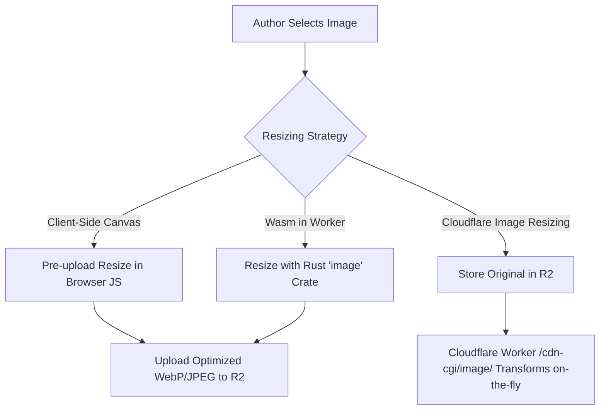

# Future Improvements: Media & Image Architecture

An architectural breakdown and roadmap for enhancing media management and optimization in Zygo CMS.

---

## 1. Direct Cover Image Upload

### Current State
- The editor provides a text input for `Cover Image URL` where authors manually paste an image URL or `/media/:key` path.

### Proposed Improvement
- Add an interactive file upload target / dropzone directly beside the `Cover Image URL` input.
- Automatically upload the file to `POST /api/media` using the authenticated R2 pipeline.
- Auto-fill the `cover_image` URL field and display an instant thumbnail preview with a "Remove" / "Replace" action.

### Technical Considerations
- **Open Graph / Twitter Card Sizing**: Standard social preview aspect ratio is **1.91:1** (recommended `1200 x 630px`).
- In `src/views.rs`, ensure Twitter card headers are populated alongside Open Graph:
  ```html
  <meta name="twitter:card" content="summary_large_image">
  <meta name="twitter:image" content="{cover_image}">
  ```

---

## 2. Media Gallery Modal (Asset Browser)

### Current State
- Images uploaded in TipTap are saved to R2 with arbitrary UUID keys (`/media/:key`).
- There is currently no way to view, search, or reuse previously uploaded images across posts.

### Architecture Options

| Approach | Implementation | Pros | Cons |
| :--- | :--- | :--- | :--- |
| **A. D1 Media Table (Recommended)** | Create a `media` table in D1 tracking `id, key, filename, mime_type, size_bytes, created_at`. | Fast indexed queries, pagination, search by filename, track post-image relationships. | Requires updating the upload handler to write to D1. |
| **B. R2 Bucket Listing** | Call `bucket.list({ prefix, cursor, limit })` via Cloudflare Worker R2 API. | No extra D1 table or migrations needed. | Limited metadata (no original filenames or search capabilities), slower pagination. |

### Proposed UX Workflow
1. Author clicks **"Browse Gallery"** (available in both the TipTap toolbar and the Cover Image section).
2. A lightweight modal renders a responsive grid of uploaded thumbnails.
3. Features:
   - Search by filename / date uploaded.
   - Direct file dropzone inside the modal for instant uploads.
   - One-click selection:
     - In TipTap: Inserts `` at the cursor.
     - In Cover Image: Populates the cover image input and closes the modal.

---

## 3. Automatic Image Resizing & Optimization

### Comparison of Approaches



### 1. Client-Side Browser Resizing (Immediate & Free)
- **How it works**: Before `POST /api/media`, load the file into an offscreen `<canvas>`, scale it down to a maximum width (e.g., max `1920px` for desktop, `1200px` for social covers), and export as high-quality WebP or JPEG (`canvas.toBlob(...)`).
- **Benefits**:
  - Zero server/worker CPU usage.
  - Faster uploads over mobile connections.
  - Drastically reduces R2 storage usage.
- **Limitation**: Only provides one static size per uploaded file.

### 2. Cloudflare Images / Edge Resizing (Dynamic Production Tier)
- **How it works**: Store original high-resolution assets in R2. When delivering images via `GET /media/:key`, leverage Cloudflare's built-in image resizing:
  ```rust
  // Cloudflare Worker Fetch with Image Resizing option
  ctx.env.media.get(&key).await...
  ```
  Or via URL transform: `/cdn-cgi/image/width=800,format=webp/media/:key`.
- **Benefits**:
  - Delivers modern formats (AVIF, WebP) automatically based on browser `Accept` headers.
  - Supports responsive `srcset` (`width=400`, `width=800`, `width=1200`).
  - Cached at Cloudflare edge cache (no recurring R2 read costs).
- **Limitation**: Cloudflare Images or Image Resizing requires a paid Cloudflare add-on / plan.

### 3. Server-side Rust Wasm Resizing (`image` crate)
- **How it works**: Decode bytes in the Worker using `image = { version = "...", default-features = false, features = ["jpeg", "png"] }`.
- **Trade-offs**: Wasm binary size increases by ~1-2 MB; CPU time on Workers free tier is capped at 50ms (which large JPEGs can easily exceed). **Not recommended for edge Workers.**

---

## Recommended Implementation Order

1. **Phase 1: Client-Side Pre-upload Resizing**: Add a simple canvas resize utility in `public/editor.js` to keep uploads under 1920px.
2. **Phase 2: Cover Image Upload Button**: Add direct upload handling and instant preview to the Cover Image form control.
3. **Phase 3: D1 Media Index & Gallery Modal**: Add a `media` migration to D1, an endpoint `GET /api/media` returning recent uploads, and the gallery modal.
4. **Phase 4: Responsive Picture & srcset Rendering**: Render `<picture>` or `srcset` tags for edge-optimized delivery.

