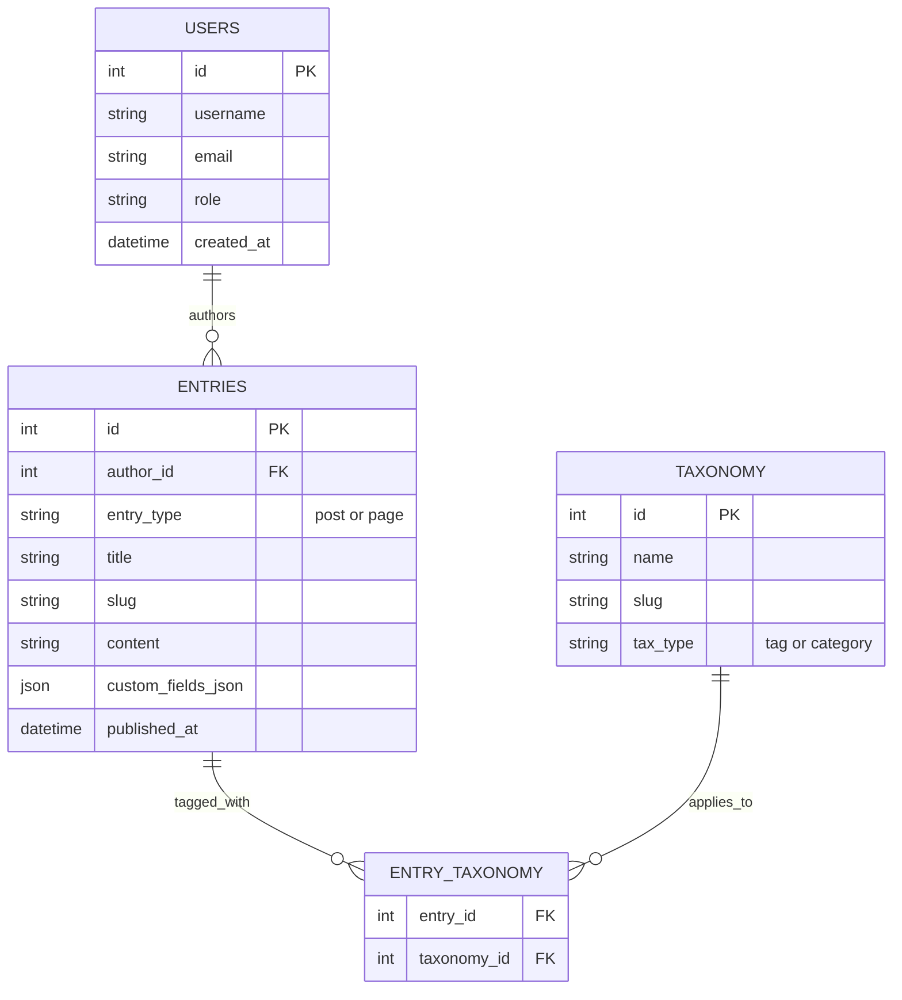

# Core Concepts

Understanding how Zygo CMS structures data is key to building powerful websites.

## Data Model Overview

The core of Zygo CMS relies on a streamlined relational model inside Cloudflare D1. Below is a high-level Entity-Relationship overview of how Users, Entries (Posts and Pages), and Taxonomies interact.

## Posts vs. Pages

Content in Zygo CMS is generally divided into two entry types, stored in the same `entries` table but handled differently by the routing and rendering engines:

### Posts
- **Use Case:** Blog articles, news updates, time-sensitive content, or chronological feeds.
- **Editor:** Standard rich-text editor (powered by Tiptap), optimized for long-form writing.
- **Routing & SEO:** Automatically routed with a customizable prefix, e.g., `/post/my-article-slug`. Canonical URLs strictly omit trailing slashes for individual posts.
- **Taxonomy & Metadata:** Natively supports tags, categories, author attribution, and scheduled publishing dates.

### Pages
- **Use Case:** Landing pages, about pages, contact forms, and evergreen structural site content.
- **Editor:** Built using the block-based **Section Templates** engine, allowing for drag-and-drop structural design rather than just text editing.
- **Routing & SEO:** Routed natively to the root path without prefixes, e.g., `/about`. As with posts, canonical URLs omit trailing slashes (except the homepage `/`).
- **Hierarchy:** Pages support parent-child relationships, enabling nested routing such as `/services/consulting` and automatic breadcrumb generation.

## Content Types & Schema Builder

The Schema Builder allows you to define custom data structures dynamically directly from the Admin UI—meaning no database migrations or `ALTER TABLE` commands are required for new content fields.

- Navigate to **Settings -> Content Types**.
- Define reusable fields like Text, Number, Date, Image, or Boolean.
- When authors create content assigned to this custom type, the Editor Sidebar will dynamically render the appropriate form inputs based on the schema.
- The structured data is safely persisted as a serialized JSON object in the `custom_fields_json` database column on the `entries` table.

**Architecture Note:** To ensure resilience across two-worker architectures, the schema builder relies heavily on Serde attributes (`#[serde(default)]` and `#[serde(skip_unknown_fields)]`). This guarantees that decoupled workers can parse JSON payloads even if the underlying dynamic schema changes, preventing unexpected panics in production.

## Menus & Navigation

Zygo CMS features a robust navigation builder.
- Create menus (e.g., "Main Header", "Footer Links").
- Add links to internal content (Pages/Posts) or external URLs.
- The Public Worker automatically resolves internal links to their canonical URLs, meaning if you change a page's slug, the menu link updates automatically.
- Automatic cache invalidation ensures that when navigation changes are published, edge caches and sitemaps are purged immediately.

## Media Library

All images and files are managed through the centralized Media Library.
- Media is primarily stored and served via Cloudflare R2 for high availability and low latency (D1 storage is available for smaller, text-heavy setups).
- When inserting an image into a Post or Page, Zygo automatically generates optimized `<picture>` markup, providing responsive image sizing and modern formats.
