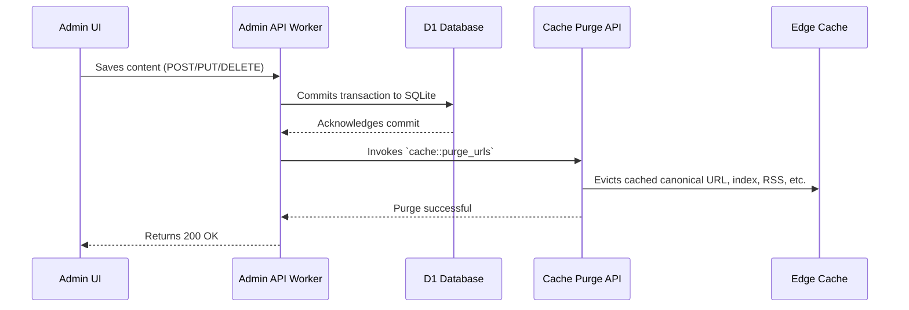

# Deployment Guide

Zygo CMS is designed to be deployed exclusively to Cloudflare's global edge network, leveraging Workers, D1 (SQLite), and aggressive edge caching.

## 1. Before You Begin

Before provisioning resources or deploying, you need to authenticate your local environment and gather a few specific keys from the Cloudflare Dashboard:

1. **Authenticate Wrangler CLI:** Run `npx wrangler login` to authorize your terminal.
2. **Zone ID:** Find the `Zone ID` for your domain on the overview page of your Cloudflare dashboard.
3. **API Token:** Create a Custom API Token with **Zone:Cache Purge:Edit** permissions.

Zygo's global caching architecture requires the Zone ID and API Token to broadcast instant cache invalidation signals to all 300+ data centers whenever you publish or update an article. Add these keys to your `.dev.vars` (for local testing) and your Cloudflare Worker secrets (for production):
- `CF_ZONE_ID`
- `CF_API_TOKEN`

## 2. Production Provisioning

We provide a setup script to automatically provision the required production resources. The Zygo CMS architecture requires a decoupled, two-worker setup: one for public traffic and one for the authenticated admin API.

```bash
node scripts/setup.mjs
```

During this interactive process, the script will:
- **Provision D1 Databases:** Create the primary SQLite database on Cloudflare's edge (`zygo-cms-db`).
- **Configure Buckets / KV:** Set up necessary storage for assets or media.
- **Environment Bindings:** Automatically inject the generated `database_id` and service tokens into your `wrangler.toml` files for both the public and admin workers.
- **Custom Domains:** Prompt you to assign custom domains for public routing (e.g., `yourdomain.com`) and the admin interface (e.g., `admin.yourdomain.com`).

## 3. Remote Migrations

Before deploying your workers, you must initialize the production database schema. Zygo CMS uses Wrangler's D1 migration system to handle schema changes.

```bash
npx wrangler d1 migrations apply zygo-cms-db --remote
```

**Important Migration Guidelines:**
- **Zero Downtime:** Always design migrations to be backward-compatible (e.g., don't use `SELECT *` in queries).
- **SQLite Limitations:** Cloudflare D1 strictly disallows non-constant defaults in `ALTER TABLE ... ADD COLUMN`. Add columns as nullable first, then backfill data using an `UPDATE` query.

## 4. Building and Deploying

Compile the Rust workers to WebAssembly and deploy the React Admin UI static assets.

```bash
# Verify all tests pass
pnpm run test:all
cargo test

# Build the project (Rust to Wasm, Vite to static files)
pnpm run build

# Deploy to Cloudflare Workers
pnpm run deploy
```

## Cache Invalidation Architecture

Zygo CMS leverages aggressive edge caching. When you edit content in the Admin UI, the `admin-api-worker` automatically issues internal purge requests to Cloudflare's Cache API. This ensures your users always see the fastest possible response times without viewing stale content. Whenever content is created, updated, or deleted, `cache::purge_urls` is invoked to clear the affected canonical URL, the homepage, RSS feed, and Sitemap.


