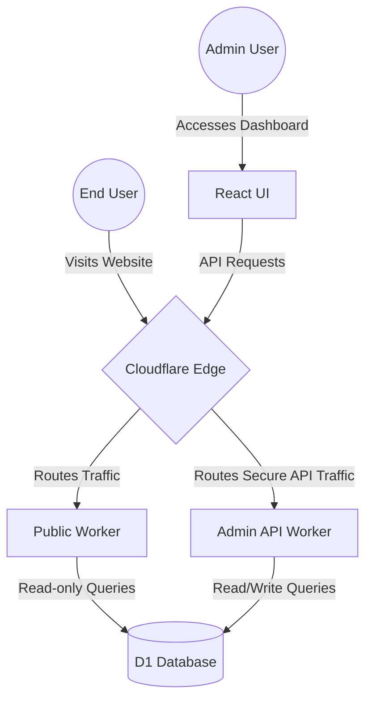

# Zygo CMS Introduction

**Zygo CMS** is a modern, statically-generated style CMS built natively for Cloudflare Workers, D1 (SQLite), and Rust. It uniquely combines the unmatched speed and simplicity of a static site generator with the rich, dynamic capabilities of a traditional database-driven content management system. By leveraging the edge, Zygo CMS delivers content directly to users with minimal latency.

# Leaning into Cloudflare

Cloudflare offers a broad array of distributed internet solutions that span the globe. At a reasonable cost, even a small organization can serve their site at blazing fast speed across the globe. By focusing on Cloudflare's tools, Zygo CMS is but a few steps to setup and deploy, yet able to provide world-class hosting speeds.

## The Tech Stack & Benefits

Zygo CMS is engineered to provide high performance, robust security, and a seamless developer experience by utilizing a modern technology stack:

- **Cloudflare Caching and DNS:** Zygo's architecture is deeply integrated with Cloudflare's Edge Cache and global DNS. By serving rendered HTML pages and API responses directly from the cache, site speed is maximized. Smart cache invalidation automatically purges stale content the moment an update is published, ensuring visitors always see the freshest content instantly.
- **Cloudflare Workers:** True serverless execution directly at the edge. This provides zero cold-starts, seamless scaling, and global distribution, ensuring that your website's logic runs as close to the end user as physically possible.
- **Cloudflare D1:** Cloudflare's serverless SQLite database hosted across their edge network. D1 offers fast, relational data access without the need to provision, scale, or manage traditional database servers, significantly minimizing operational overhead.
- **Cloudflare R2:** Global object storage at the edge. R2 hosts images, videos, and other media assets with zero egress fees, seamlessly integrating with the Zygo CMS Media Library to deliver assets quickly worldwide.
- **Rust (Wasm):** The core business logic, routing, and API handling are written in Rust and compiled to WebAssembly (Wasm). Rust guarantees memory safety and predictable, blazing-fast performance without garbage collection pauses, making it an ideal choice for high-throughput edge environments.
- **React Admin UI:** A polished, fully decoupled modern dashboard built with React. It provides an intuitive interface for managing content, media, menus, and site settings without impacting the performance of the public-facing site.

## Two-Worker Architecture

To maximize security and performance, Zygo CMS separates concerns into two distinct Cloudflare Workers sharing a D1 database. This decoupled approach ensures that the public site remains hyper-optimized for read operations, while the administrative worker is equipped with all the necessary tools for content authoring.

1. **`admin-api-worker` (The Writer):** 
   A secure, feature-rich worker that feeds the React Admin UI as its backend API. It handles authentication, complex data validation, media processing, workflow state transitions, and rich-text storage. Since it is entirely isolated from the public worker, administrative overhead never slows down the end-user experience.
   
2. **`public-worker` (The Reader):** 
   An ultra-fast, read-only worker exclusively responsible for delivering your website. It queries D1, renders HTML using the fast Minijinja templating engine, and heavily leverages Cloudflare's Edge Cache to serve pages instantly. It minimizes moving parts to ensure the highest possible reliability.

### Architecture Diagram

The following flowchart illustrates how traffic and data flow through the Zygo CMS Two-Worker Architecture:

By strictly splitting these responsibilities, the public-facing site remains incredibly lightweight and fast, while the admin side retains all the necessary power for flexible and comprehensive content management.
