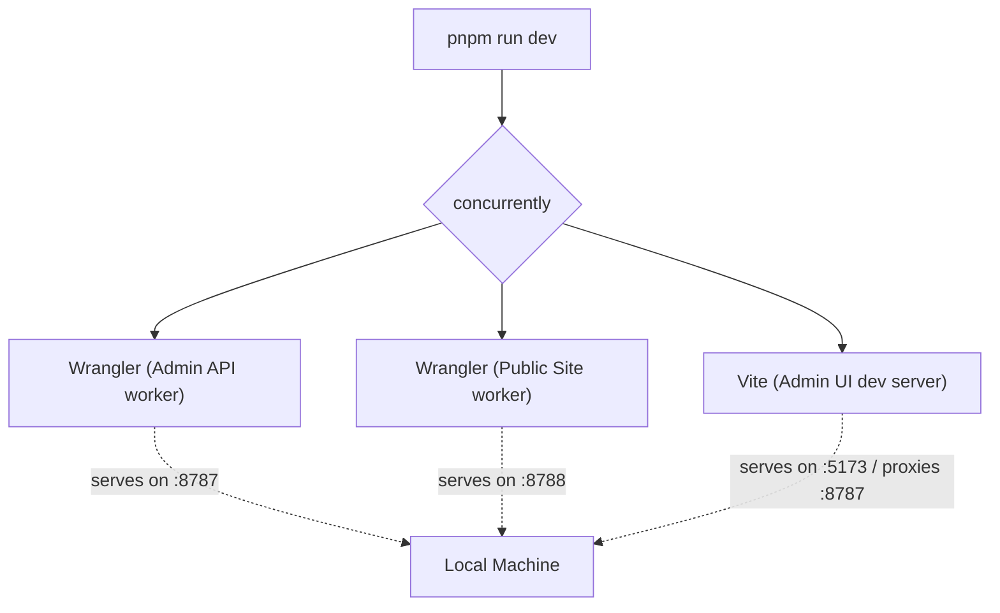

# Quickstart

Get up and running with Zygo CMS on your local machine in minutes. This guide walks you through the prerequisites, installation, local database setup, and booting up the development environment.

## Prerequisites

Before you begin, ensure your development environment is properly configured with the following tools:

- **[Node.js](https://nodejs.org/)** (v18 or higher): The JavaScript runtime used for our frontend tooling and scripts.
- **[pnpm](https://pnpm.io/)**: Our preferred package manager. It is fast and disk-space efficient.
- **[Rust & Cargo](https://rustup.rs/)**: Required for compiling the Cloudflare Workers backend, which is written in Rust using `worker-rs`.
- **[Wrangler CLI](https://developers.cloudflarecom/workers/wrangler/install-and-update/)**: Cloudflare's official CLI for managing and deploying Workers and D1 databases.

## 1. Installation

Bootstrap a new project using our CLI tool. This command will scaffold a new directory with the complete Zygo CMS structure.

```bash
npx create-zygo-app my-new-site
cd my-new-site
pnpm install
```

*Note: If you are contributing directly to the Zygo CMS repository, you can simply clone the repo and run `pnpm install` instead.*

## 2. Local Database Setup

Zygo CMS relies on Cloudflare D1 for its database. For local development, Wrangler provides a local SQLite environment that mimics D1. Before starting the server, you must initialize the local database schema by applying the migrations:

```bash
npx wrangler d1 migrations apply zygo-cms-db --local
```

This creates a local `.wrangler` directory containing the SQLite state.

## 3. Start the Development Server

Boot up the backend workers and frontend Admin UI simultaneously using the provided development script:

```bash
pnpm run dev
```

### Understanding the Startup Flow

The `dev` script utilizes the `concurrently` package to orchestrate multiple processes within a single terminal window. This ensures all pieces of the architecture are running in sync:

1. **Admin API Worker (Wrangler/Rust)**: Serves the backend GraphQL/REST endpoints for the CMS dashboard.
2. **Public Website Worker (Wrangler/Rust)**: Renders and serves the public-facing static site and templates.
3. **Admin UI (Vite/React)**: Serves the administrative dashboard frontend and proxies API requests to the Admin API worker to avoid CORS issues.



## 4. First Steps

Once the terminal output stabilizes and indicates all servers are running:

1. Open **[http://localhost:8788/admin](http://localhost:8788/admin)** in your web browser.
2. Because the database is entirely fresh, the system will automatically prompt you to create the initial administrative user profile.
3. Follow the on-screen instructions to set your email and password.
4. Once logged in, navigate to **Content -> Pages** in the sidebar to start building your site!

## Troubleshooting

If you run into issues during the quickstart process, consider these common solutions:

- **Address in Use (Port Conflict)**: If you see an error about `EADDRINUSE`, ensure ports `8787`, `8788`, and `5173` are not occupied by other applications. You can terminate orphaned Wrangler processes or modify the dev script ports if necessary.
- **Database Errors (No Such Table)**: If the Admin UI throws a "table not found" or 500 error on your first visit, verify that you successfully ran the `wrangler d1 migrations apply` command with the `--local` flag.
- **Rust Compilation Failures**: If Cargo fails to build the workers, ensure your Rust toolchain is up-to-date by running `rustup update`. Additionally, verify that `wasm-pack` is properly installed or auto-managed by the build script.
